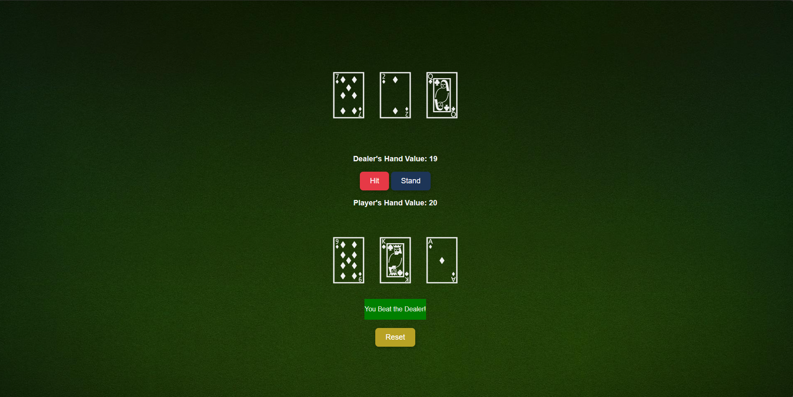

# 🃏 Blackjack Game

A simple browser-based Blackjack game built using HTML, CSS, and JavaScript. The game is self-contained and runs entirely on the client side, handling all gameplay logic without a backend.

## 🚀 Features

- Standard Blackjack rules
- Hit, Stand, and Reset functionality
- Basic card visuals (text-based or image-based, depending on your implementation)
- Score calculation for player and dealer

## 🛠 Technologies Used

- HTML
- CSS
- JavaScript (Vanilla)

## 📂 How to Run

1. Clone or download the repository.
2. Make sure the following files are present in the same folder:
   - `blackjack.html`
   - `blackjack.css`
   - `blackjack.js` 
3. Open `blackjack.html` in any modern browser.

## 📌 Notes

This project was built to reinforce DOM manipulation and JavaScript logic. There is no backend — all game state is handled in the browser.

## 🖼️ Screenshot

